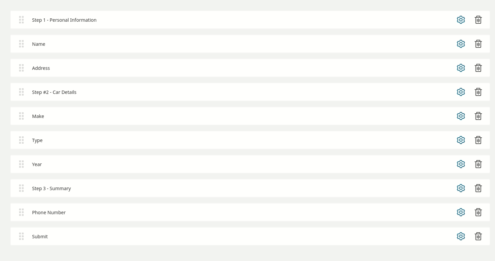

# ezplatform-form-builder-multi-step-forms

## Description
The bundle provides a "step" field for the Form Builder in eZ Platform EE which makes Form "Multi-Step".

## Usage
This bundle provides a default (and very basic) template that uses Bootstrap 4 to create a carousel which is used for 
step transitions, but you can use any solution you prefer. To do so, you will have to override the default template 
(`@ezdesign/formbuilder_multistep/steps.html.twig`).

If Step Field is not the very first field used in the Form, fields before first Step Field will be rendered below the 
carousel (in the default template). If there is no Step Field inside Form it will be rendered normally.
Step Field has couple of attributes:

`step_class` - the default template will add this CSS class to the step `<div>` tag.

`next_label` - if this field is not empty, the default template will render the "next step" button with the defined 
label.

`back_label` - if this field is not empty, the default template will render the "previous step" button with the defined 
label.

`custom_template` - if this field is not empty, the default template will use this custom twig file for this step 
template (``)

It is up to you to add any additional features in javascript (for example: disable "next" button, until all fields in 
steps are filled).

## Installation
### 1. Enable `EzPlatformFormBuilderMultiStepFormsBundle`
Edit `app/AppKernel.php`, and add 
```
new MateuszBieniek\EzPlatformFormBuilderMultiStepFormsBundle\EzPlatformFormBuilderMultiStepFormsBundle(),
```
at the end of the `$bundles` array.
### 2. Install `mateuszbieniek/ezplatform-form-builder-multi-step-forms`
```
composer require mateuszbieniek/ezplatform-form-builder-multi-step-forms
```
